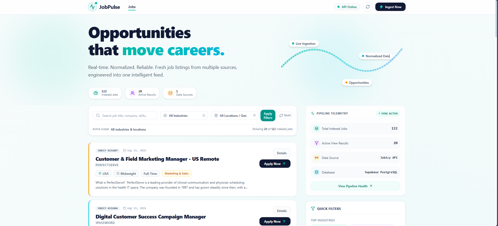
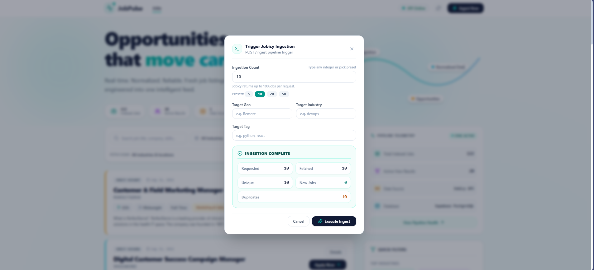

# JobPulse

A resilient, end-to-end job listing ingestion and discovery platform built with **Python**, **FastAPI**, **PostgreSQL (Supabase)**, and **React**. 

JobPulse bridges external job API ingestion with persistent data storage and a modern discovery dashboard. It is engineered with failure handling, response validation, HTML text cleaning, multi-stage deduplication, database safety guards, and test coverage.

> **Project Status:** Complete and fully tested — 25 automated tests passing.

---

## 1. Project Overview

External job APIs often suffer from rate limits, inconsistent payloads, duplicate listings, and unformatted HTML fields. JobPulse addresses these challenges by isolating external data fetching behind an ingestion engine that standardizes, deduplicates, and safely stores job listings.

### Data Flow
1. **Trigger**: An ingestion request specifies requested job count, industry, location, or tag filters.
2. **Fetch & Retry**: The backend client issues synchronous HTTP requests to Jobicy, automatically retrying with exponential backoff on network timeouts (`httpx.TimeoutException`), connection errors, rate limits (`429`), or upstream server failures (`500`-`504`).
3. **Validation & Normalization**: Raw JSON payloads are validated against Pydantic response schemas. HTML fields (descriptions, excerpts, titles) are stripped and normalized via BeautifulSoup4.
4. **Deduplication**: Incoming listings are deduplicated in memory using composite keys (`source:source_job_id`), followed by database-level unique constraint checks.
5. **Persistence**: Validated, unique jobs are committed to a Supabase PostgreSQL database.
6. **Discovery**: A FastAPI REST API serves paginated, filtered job listings. Title and company search is performed client-side in the React frontend dashboard.

---

## 2. Architecture

```
                                  [ Jobicy API ]
                                        │
                                        ▼
                               [ Jobicy Client ]
                                        │ (Exponential Backoff Retries)
                                        ▼
                            [ Pydantic Validation ]
                                        │
                                        ▼
                          [ BeautifulSoup Normalizer ]
                                        │
                                        ▼
                           [ In-Batch Deduplication ]
                                        │
                                        ▼
                             [ JobRepository Layer ]
                                        │ (UNIQUE Constraint Safeguard)
                                        ▼
                           [ Supabase PostgreSQL DB ]
                                        │
                                        ▼
                           [ FastAPI REST Endpoint ]
                                        │
                                        ▼
                          [ React + JavaScript UI ]
```

### Core Endpoints
- `GET /` — API root status
- `GET /health` — API health/status check
- `GET /jobs` — Paginated job feed with location and industry filters
- `POST /ingest` — Live ingestion pipeline trigger

---

## 3. Data Ingestion Pipeline

The ingestion pipeline (`JobIngestionPipeline`) executes six discrete stages:

1. **Fetch**: `JobicyClient.fetch_jobs(count, tag, geo, industry)` dispatches synchronous requests to the external REST API.
2. **Retry & Resilience**: Captures network exceptions and status codes, applying exponential backoff (`delay = base_retry_delay * 2^attempt`) for up to 3 retries.
3. **Validation**: `validate_jobicy_response()` parses raw response objects with Pydantic (`JobicyResponse`), enforcing expected data types and structural integrity.
4. **Normalization**: `normalize_job()` cleans raw HTML tags from titles, descriptions, and excerpts using BeautifulSoup4, mapping raw fields into strongly typed `Job` models.
5. **In-Batch Deduplication**: `deduplicate_jobs()` filters out duplicate listings within the same payload based on unique `source:source_job_id` keys.
6. **Persistence**: `JobRepository.save_job()` attempts database insertion. If a listing already exists in the database, the unique constraint violation is trapped and safely ignored without aborting the batch.

---

## 4. Resilience

The HTTP ingestion client is built with `httpx` and handles real-world API instability:

| Scenario | HTTP / Error Code | Handling Strategy |
| :--- | :--- | :--- |
| **Successful Request** | `200 OK` | Validates payload and continues pipeline |
| **Rate Limit** | `429 Too Many Requests` | Logs warning, waits exponential backoff delay, and retries |
| **Server Error** | `500`, `502`, `503`, `504` | Logs failure, waits exponential backoff delay, and retries |
| **Network Timeout** | `httpx.TimeoutException` | Retries up to 3 times before raising controlled error |
| **Connection Refused** | `httpx.ConnectError` | Retries up to 3 times with backoff |
| **Schema Mismatch** | Pydantic `ValidationError` | Logs validation errors and halts batch to prevent data corruption |

---

## 5. Deduplication & Idempotency

JobPulse enforces idempotency at two distinct levels:

### 1. In-Memory In-Batch Deduplication
Before writing to storage, listings are keyed by `f"{job.source}:{job.source_job_id}"`. Duplicate items present within the same API payload are collapsed into a single instance.

### 2. Database Constraint Idempotency
The PostgreSQL `jobs` table enforces a strict composite unique constraint:
```sql
UNIQUE(source, source_job_id)
```
When `JobRepository.save_job()` executes an `INSERT INTO jobs`, any duplicate record triggers a `psycopg.errors.UniqueViolation`. The repository traps the exception, rolls back the transaction, and returns `False`. 

As a result, executing the same ingestion command repeatedly will not create duplicate database entries.

---

## 6. Database

JobPulse uses **Supabase PostgreSQL** for data persistence.

### Database Schema (`jobs` table)
```sql
CREATE TABLE IF NOT EXISTS jobs (
    id BIGSERIAL PRIMARY KEY,
    source TEXT NOT NULL,
    source_job_id BIGINT NOT NULL,
    title TEXT NOT NULL,
    company TEXT NOT NULL,
    location TEXT,
    job_type JSONB NOT NULL,
    industry JSONB NOT NULL,
    level TEXT,
    description TEXT NOT NULL,
    excerpt TEXT,
    job_url TEXT NOT NULL,
    published_at TIMESTAMPTZ NOT NULL,
    salary_min DOUBLE PRECISION,
    salary_max DOUBLE PRECISION,
    salary_currency TEXT,
    created_at TIMESTAMPTZ NOT NULL DEFAULT NOW(),
    updated_at TIMESTAMPTZ NOT NULL DEFAULT NOW(),
    UNIQUE(source, source_job_id)
);
```

### Schema Data Types
- **`id`**: `BIGSERIAL` primary key.
- **`source_job_id`**: `BIGINT` external job identifier.
- **`job_type` & `industry`**: `JSONB` arrays storing list values (e.g., `["Full-Time"]`, `["devops"]`).
- **`published_at`**, **`created_at`**, **`updated_at`**: `TIMESTAMPTZ` timezone-aware timestamps.

### JSONB Filtering
`industry` and `job_type` fields use PostgreSQL `JSONB` array containment operators:
```sql
SELECT * FROM jobs WHERE industry @> '["Data Engineering"]'::jsonb;
```

---

## 7. API Reference

### `GET /`
Returns basic platform operational status.

### `GET /health`
API health/status check.
```json
{
  "status": "healthy"
}
```

### `GET /jobs`
Fetches a paginated feed of jobs from the database filtered by location or industry. Title and company search is performed client-side on the frontend.

**Query Parameters:**
- `page` *(int, default: 1)* — Page number.
- `page_size` *(int, default: 20, max: 100)* — Listings per page.
- `geo` *(string, optional)* — Location filter (e.g., `Remote`).
- `industry` *(string, optional)* — Industry tag filter (e.g., `devops`).

**Illustrative Example Response:**
```json
{
  "status": "success",
  "result": {
    "jobs": [
      {
        "source": "jobicy",
        "source_job_id": 109283,
        "title": "Senior DevOps Engineer",
        "company": "CloudTech",
        "location": "Remote",
        "job_type": ["Full-Time"],
        "industry": ["devops"],
        "level": "Senior",
        "description": "Cleaned plaintext job description...",
        "excerpt": "Short job summary...",
        "job_url": "https://jobicy.com/jobs/109283",
        "published_at": "2026-08-19T10:00:00Z",
        "salary_min": 120000.0,
        "salary_max": 150000.0,
        "salary_currency": "USD"
      }
    ],
    "total": 45,
    "page": 1,
    "page_size": 20
  }
}
```

### `POST /ingest`
Triggers live API fetching, deduplication, and persistence.

**Query Parameters:**
- `count` *(int, default: 10)* — Target ingestion batch size.
- `geo` *(string, optional)* — Target location restriction.
- `industry` *(string, optional)* — Target industry filter.
- `tag` *(string, optional)* — Target technology tag.

**Illustrative Example Response:**
```json
{
  "status": "success",
  "result": {
    "fetched": 100,
    "unique": 100,
    "inserted": 15
  }
}
```

---

## 8. Ingestion Count Behavior

When triggering ingestion, the requested count represents the number requested from the upstream API:

- **Observed Upstream Behavior**: Jobicy currently returns a maximum of 100 jobs in a single response based on observed API behavior. Therefore, requesting 120 jobs may result in 100 fetched records. JobPulse does **not** artificially cap the user's requested ingestion count input at 100.
- **Pipeline Metrics Distinction**:
  - `Requested` = The number requested by the user
  - `Fetched` = The number actually returned by the Jobicy API
  - `Unique` = The number remaining after in-batch deduplication
  - `New Jobs` = Newly inserted database records (depends on existing database state)
  - `Duplicates` = Records already present in the database (depends on existing database state)

Note that the specific breakdown of `New Jobs` vs. `Duplicates` below is an **illustrative scenario**, not a guaranteed constant relationship, as it depends directly on which listings are already stored in the database.

*(Illustrative Example Scenario)*
```
Requested:    120
Fetched:      100
Unique:       100
New Jobs:      20
Duplicates:    80
```

---

## 9. Frontend

The frontend is a single-page dashboard built with **React**, **JavaScript/JSX**, **Vite**, and **Tailwind CSS**.

### Key Features
- **Job Feed**: Real-time job cards presenting company information, titles, locations, salaries, and industry tags.
- **Search & Filters**: Client-side keyword search with backend industry and geo filters.
- **Job Details Drawer**: Slide-over drawer rendering full job details, descriptions, and direct application links.
- **Ingestion Control Modal**: Interactive modal for triggering live ingestion runs with ingestion progress and result feedback.
- **API Health Indicator**: Navbar status pill showing API health status.
- **Visual Identity**: Clean light background, deep navy headers (`#111A35`), vibrant teal primary accents, and subtle status badges.

---

## 10. Tech Stack

| Domain | Technology | Usage |
| :--- | :--- | :--- |
| **Backend Framework** | FastAPI | REST API routing and request handling |
| **Language** | Python | Backend application logic |
| **Data Validation** | Pydantic / Pydantic Settings | Environment configuration and API schema validation |
| **HTTP Client** | HTTPX | Synchronous HTTP requests with retries |
| **HTML Parsing** | BeautifulSoup4 | Normalizing and stripping HTML markup |
| **Database** | Supabase PostgreSQL | Relational storage |
| **Database Driver** | psycopg | PostgreSQL driver for Python |
| **Frontend Framework** | React | UI component rendering |
| **Build Tool** | Vite | Frontend bundling |
| **Styling** | Tailwind CSS | Utility-first responsive design system |
| **Iconography** | Lucide React | UI icons |
| **Testing** | pytest & AnyIO | Automated test suite and test client |

---

## 11. Project Structure

```
jobpulse/
├── app/
│   ├── api/
│   │   └── routes.py            # FastAPI route handlers (/health, /jobs, /ingest)
│   ├── core/
│   │   ├── config.py            # Pydantic environment configuration
│   │   └── logger.py            # Structured application logger
│   ├── ingestion/
│   │   ├── deduplicator.py      # In-batch duplicate removal logic
│   │   ├── jobicy_client.py     # Resilient HTTPX client with retries
│   │   ├── normalizer.py        # BeautifulSoup HTML cleaning
│   │   ├── pipeline.py          # Ingestion pipeline orchestrator
│   │   └── validator.py         # Response schema validation
│   ├── models/
│   │   ├── job.py               # Normalized Job domain model
│   │   └── jobicy_response.py   # Raw Jobicy API response Pydantic models
│   ├── storage/
│   │   ├── database.py          # Connection pool & safety guards
│   │   └── job_repository.py    # PostgreSQL queries & CRUD operations
│   └── main.py                  # FastAPI application entrypoint & CORS setup
├── frontend/
│   ├── src/
│   │   ├── components/          # React UI components (FilterBar, JobCard, IngestModal, etc.)
│   │   ├── hooks/               # Custom hooks (useJobs, useHealth)
│   │   ├── services/            # API client service layer
│   │   ├── App.jsx              # Main dashboard layout
│   │   └── index.css            # Global Tailwind styles
│   ├── package.json             # Frontend dependencies & scripts
│   └── README.md                # Frontend documentation
├── tests/
│   ├── conftest.py              # Test database fixtures & mock HTTP server thread
│   ├── mock_source.py           # Mock Jobicy HTTP server endpoints
│   ├── test_api.py              # FastAPI endpoint integration tests
│   ├── test_database.py         # Database initialization tests
│   ├── test_deduplicator.py     # Deduplication unit tests
│   ├── test_jobs_api.py         # Job querying & filtering tests
│   ├── test_pipeline.py         # Pipeline end-to-end integration tests
│   ├── test_repository.py       # PostgreSQL repository tests
│   ├── test_resilience.py       # Network retry & error resilience tests
│   └── test_validator.py        # Pydantic schema validation tests
├── .env.example                 # Template for environment variables
├── pytest.ini                  # Pytest configuration
├── README.md                    # Root project documentation
└── requirements.txt             # Python backend dependencies
```

---

## 12. Local Setup

### Prerequisites
- Python 3.11+
- Node.js 18+
- Supabase PostgreSQL database instance

### Step-by-Step Installation

1. **Clone the Repository**
   ```bash
   git clone https://github.com/maneesh6531/jobpulse.git
   cd jobpulse
   ```

2. **Set Up Python Virtual Environment**
   ```bash
   python -m venv venv
   # On Windows:
   .\venv\Scripts\activate
   # On macOS/Linux:
   source venv/bin/activate
   ```

3. **Install Backend Dependencies**
   ```bash
   pip install -r requirements.txt
   ```

4. **Configure Environment Variables**
   Copy `.env.example` to `.env`:
   ```bash
   cp .env.example .env
   ```
   Update `.env` with your connection strings:
   ```env
   DATABASE_URL=<your Supabase PostgreSQL connection string>
   TEST_DATABASE_URL=<your separate test PostgreSQL connection string>
   JOBICY_API_URL=https://jobicy.com/api/v2/remote-jobs
   ```

5. **Start the FastAPI Server**
   ```bash
   uvicorn app.main:app --reload --port 8000
   ```

6. **Set Up & Launch Frontend**
   In a second terminal:
   ```bash
   cd frontend
   npm install
   npm run dev
   ```
   Open `http://localhost:5173` in your browser.

---

## 13. Environment Variables

| Variable | Required | Purpose |
| :--- | :--- | :--- |
| `DATABASE_URL` | Yes | Primary Supabase PostgreSQL connection string for application runtime |
| `TEST_DATABASE_URL` | Yes (for tests) | Isolated PostgreSQL connection string used exclusively by pytest |
| `JOBICY_API_URL` | No | Target API URL (Defaults to `https://jobicy.com/api/v2/remote-jobs`) |

> **Security Note:** `.env` is included in `.gitignore` and is never committed to source control.

---

## 14. Testing

The backend includes an automated test suite using `pytest`.

### Running Tests
```bash
pytest tests/ -v
```

### Verified Test Results
```
collected 25 items

tests/test_api.py ::: PASSED
tests/test_database.py . PASSED
tests/test_deduplicator.py .. PASSED
tests/test_jobs_api.py ...... PASSED
tests/test_pipeline.py .. PASSED
tests/test_repository.py .. PASSED
tests/test_resilience.py ....... PASSED
tests/test_validator.py .. PASSED

================== 25 passed, 1 warning ==================
```

---

## 15. Database Safety Mechanism

To prevent tests from accidentally truncating or mutating production data, JobPulse implements strict database safety checks in `app/storage/database.py`:

```python
def verify_safe_test_db(db_url: str):
    prod_url = settings.database_url
    if db_url.strip() == prod_url.strip():
        raise RuntimeError(
            "CRITICAL SAFETY VIOLATION: Active database URL matches production DATABASE_URL! "
            "Tests are strictly forbidden from connecting to or modifying the production database."
        )
```

- When running under `pytest`, the database driver enforces that `TEST_DATABASE_URL` is set and distinct from `DATABASE_URL`.
- If the URLs match or point to the production database, execution halts instantly with a `RuntimeError`.

---

## 16. Quick-Start Command Summary

```bash
# Start Backend
uvicorn app.main:app --reload --port 8000

# Start Frontend
cd frontend && npm run dev

# Run Backend Tests
pytest tests/ -v

# Build Production Frontend
cd frontend && npm run build
```

---

## 17. Screenshots

### Job Discovery Dashboard



The main JobPulse dashboard showing the job feed, search and filtering controls, API health status, pipeline telemetry, and responsive job cards.

### Ingestion Pipeline



The ingestion interface showing the requested ingestion count and the resulting fetched, unique, new-job, and duplicate statistics.

---

## 18. Engineering Highlights

- **Resilient Pipeline Architecture**: Gracefully handles network blips, 429 rate limits, and 5xx server errors with exponential backoff.
- **Database Safety Guard**: Hardened test isolation preventing accidental operations on production data.
- **Two-Stage Deduplication**: Combines in-memory key hashing with PostgreSQL composite `UNIQUE` constraint enforcement.
- **HTML Content Normalization**: Uses BeautifulSoup4 to parse and strip HTML markup from third-party raw job text before storage and display.
- **JSONB Query Optimization**: Uses PostgreSQL `JSONB` array containment operators for filtering job sectors and types.

---

## 19. Future Improvements

- **Scheduled Background Tasks**: Integrating Celery or APScheduler for automated periodic ingestion runs.
- **Multi-Source Connectors**: Extending the pipeline to ingest from additional remote job APIs (e.g., Remotive, RemoteOK).
- **Caching Layer**: Introducing Redis caching for high-frequency `/jobs` queries.
- **Observability**: Adding OpenTelemetry tracing and Prometheus metrics for pipeline execution monitoring.

---

## 20. Development Notes

- Ensure the configured Supabase PostgreSQL database is reachable.
- Tests operate exclusively against the isolated `TEST_DATABASE_URL` database and may clear/reinitialize test data during execution.